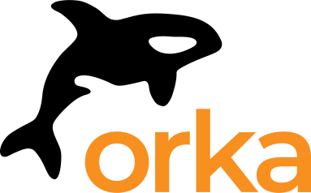

# Orka by MacStadium Integrations

[![MIT licensed][badge-license]](LICENSE)

This repository contains integrations between [Orka by MacStadium][orka] and different CI/CD systems.

### Jenkins

MacStadium provides a Jenkins plugin that integrates with Orka. It can be found [here][jenkins-plugin].

### GitHub

The integration guide for GitHub can be found [here](GitHub/README.md).

### GitLab

The integration guide for GitLab can be found [here](GitLab/README.md).

### Buildkite

The integration guide for Buildkite can be found [here](Buildkite/README.md).

[orka]: https://www.macstadium.com/orka
[jenkins-plugin]: https://plugins.jenkins.io/macstadium-orka
[badge-license]: https://img.shields.io/badge/License-MIT-green.svg
